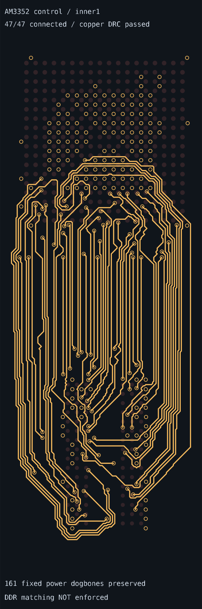

# Control routing on inner1

The explicit connectivity configuration routes all 47 native AM3352/RAM
signals on `inner1`, with local top-layer escapes and exactly two plated vias
per signal. It preserves all 161 fixed power dogbones and their recorded
FanoutSolver provenance. No saved routing plan is replayed.

```sh
bun scripts/route-control-inner1.ts
```

The command writes the complete SRJ, independent report and connectivity
snapshot to `work/control-inner1` only after solver success, native output
preservation, complete pad-to-pad connectivity and copper DRC checks pass.
The existing full DDR snapshot exporter is unchanged.

| Measurement | Result |
| --- | ---: |
| Native signals connected | 47 / 47 |
| Signal carrier | inner1 only |
| Fixed power fanouts preserved | 161 / 161 |
| Signal vias / total vias | 94 / 255 |
| Independent copper DRC issues | 0 |
| Routing runtime | 35.25 s |
| Total signal planar copper | 1343.00 mm |
| BYTE0 total copper skew / limit | 16.0325 / 0.635 mm |
| BYTE1 total copper skew / limit | 4.4872 / 0.635 mm |
| Pair 0 / 1 / 2 skew (0.127 mm limit) | 8.4141 / 4.0186 / 0.8487 mm |
| Ordinary corners requiring refinement | 57 |

This is a **completed connectivity stage**, not a length-matched DDR result.
Differential coupling, timing and corner refinement remain outside this stage.
The independent [report](report.json) includes full pad-to-pad lengths, routing
quality measurements and immutable fanout provenance.



## Existing matched benchmark snapshots

The nine declared matched benchmarks and their solver configuration are
unchanged. These existing completed snapshots were inspected during this change;
they are historical matched results, not images of timed-out benchmark runs:

| Declared sample | Completed matched snapshot |
| --- | --- |
| control | [image](../routed-am3352-complete-ca/baseline/control-solved.png) |
| right | [image](../routed-am3352-complete-ca/baseline/right-solved.png) |
| left | [image](../routed-am3352-complete-ca/baseline/left-solved.png) |
| above | [image](../routed-am3352-complete-ca/baseline/above-solved.png) |
| inner-layers | [image](../routed-am3352-complete-ca/baseline/inner-layers-solved.png) |
| inner-layers-right | [image](../routed-am3352-complete-ca/baseline/inner-layers-right-solved.png) |
| inner-layers-left | [image](../routed-am3352-complete-ca/baseline/inner-layers-left-solved.png) |
| inner-layers-above | [image](../routed-am3352-complete-ca/baseline/inner-layers-above-solved.png) |
| inner-layers-complete-ca | [image](../routed-am3352-complete-ca/complete-ca-solved.png) |

## Matched benchmark rerun

`./benchmark.sh --output work/benchmark-final.json` used the unchanged matched
goal and a 180-second limit per sample. Six cases passed complete connectivity,
independent copper DRC, timing and pair-coupling validation. The final three
timed out; their retained route counts are not accepted routing or matching
passes. These are the same timeout cases seen before this change.

| Sample | Accepted | Runtime | Byte-bus skews (mm) | Final copper DRC |
| --- | --- | ---: | --- | --- |
| control | 47/47 + matching | 47.66 s | 0.635000 / 0.635000 | pass |
| right | 47/47 + matching | 37.70 s | 0.635000 / 0.635000 | pass |
| left | 47/47 + matching | 50.45 s | 0.635000 / 0.511147 | pass |
| above | 47/47 + matching | 57.85 s | 0.635000 / 0.635000 | pass |
| inner-layers | 47/47 + matching | 70.26 s | 0.635000 / 0.635000 | pass |
| inner-layers-right | 47/47 + matching | 104.06 s | 0.635000 / 0.635000 | pass |
| inner-layers-left | timed out | 180.00 s | not accepted | not finally audited |
| inner-layers-above | timed out | 180.05 s | not accepted | not finally audited |
| inner-layers-complete-ca | timed out | 182.05 s | not accepted | not finally audited |

[The complete benchmark report](matched-benchmark.json) includes per-member total
copper lengths, pair skews, provenance checks and timeout statuses.
