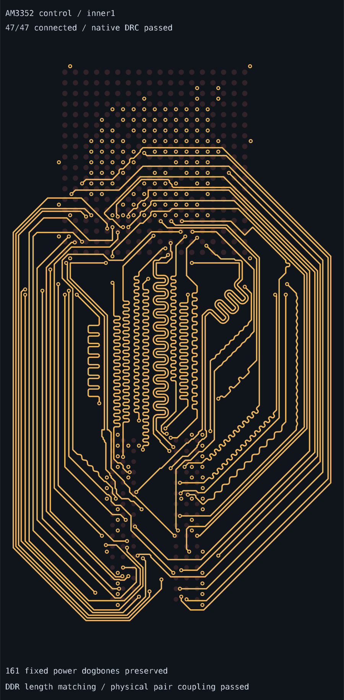

# Matched control routing on inner1

The `control-inner1` preset computes all 47 AM3352/RAM signals from their original
native pads using one inner1 carrier and owned TOP escapes. Each signal has two
plated vias. All 161 immutable FanoutSolver power traces, vias, pad joins and
provenance records are preserved.

```sh
bun scripts/route-control-inner1.ts
```

The default matched pipeline derives the paired backbones from the actual
package fields and selects a common 33 mm target for the two byte buses. Native
search keeps congestion cost and whole-route length as separate resources;
timing banks and controls negotiate together. Fine-grid repairs release nearby
package exits when a frozen neighbor prevents the last conflict from clearing.
No stored route is replayed, and connected or unmatched intermediate states
cannot be accepted.

```ts
const solver = new BusLanesPipelineSolver(input, {
  singleCarrier: { fixedConnections: metadata.powerConnections },
})
solver.solve()
if (!solver.solved) throw Error(solver.error ?? "Routing failed")
const output = solver.getOutput()
```

| Measurement | Result |
| --- | --- |
| Signals | 47/47; inner1 carriers |
| Fixed power | 161 traces/vias/pad joins preserved |
| Signal vias | 94 (two per signal); 255 total |
| Native combined-copper DRC | Pass; zero issues on all four physical layers |
| BYTE0 / BYTE1 skew (mm) | 0.635000 / 0.635000 |
| DQS0 / DQS1 / CK skew (mm) | 0.048900 / 0.004720 / 0.002792 |
| Pair exterior separated length | 0 mm for all three pairs |
| Invalid ordinary segments or corners | 0 |
| Fresh default routing runtime | 1906.120 s |

Matching measures whole pad-to-pad planar copper, including both owned TOP
escapes. Coupling is checked independently from shared-section annotations;
all three pairs have zero separated copper outside the native package fields.
The original 0.635 mm byte-bus skew, 0.127 mm pair skew, copper dimensions and
native DRC rules are unchanged. Routing runtime includes matching and varies
with machine load; the benchmark allows 3600 seconds per sample.

The [independent report](report.json) includes every signal length, actual
combined-copper DRC, geometry/coupling measurements and immutable provenance.
The [eleven-sample gallery](../routed-am3352-placements/README.md) contains only
successfully completed, audited routes.

The view below shows the inner1 plane. The gallery shows all four physical
planes, including owned TOP escapes and fixed power dogbones.


