# Eleven powered AM3352/RAM routing samples

All eleven declared samples were freshly routed by the standard benchmark workers. Each passed 47/47 connectivity, native combined-copper DRC, whole pad-to-pad length matching and physical pair coupling. The 161 fixed FanoutSolver power traces, vias, pad joins and provenance remain unchanged. Captured successful outputs were independently audited again before snapshot export.

The `control-inner1` sample uses only inner1 carriers with owned TOP escapes and two plated vias per signal. Routing includes matching; times vary with machine load. Byte-bus skew limits remain 0.635 mm and pair skew limits remain 0.127 mm, with the existing numerical epsilon. All three pairs have zero separated exterior copper in every sample.

[Complete benchmark measurements](benchmark-results.json), [artifact hashes](artifact-manifest.json), [scene verification](scene-verification.json) and [visual inspection](visual-inspection.md).

| Sample | Routing (s) | Signals | Carrier layer counts | Native DRC | BYTE0 / BYTE1 skew (mm) | Complete CA/CK skew (mm) | DQS0 / DQS1 / CK skew (mm) |
| --- | ---: | --- | --- | --- | --- | --- | --- |
| [control](control-solved.png) | 69.153 | 47/47 | inner2: 16, inner1: 19, bottom: 12 | Pass | 0.635000 / 0.635000 | — | 0.077868 / 0.126884 / 0.072830 |
| [control-inner1](control-inner1-solved.png) | 1906.120 | 47/47 | inner1: 47 | Pass | 0.635000 / 0.635000 | — | 0.048900 / 0.004720 / 0.002792 |
| [right](right-solved.png) | 54.406 | 47/47 | inner2: 18, inner1: 21, bottom: 8 | Pass | 0.635000 / 0.635000 | — | 0.096047 / 0.121802 / 0.102644 |
| [left](left-solved.png) | 69.314 | 47/47 | inner2: 20, inner1: 18, bottom: 9 | Pass | 0.635000 / 0.511147 | — | 0.010514 / 0.127000 / 0.105429 |
| [above](above-solved.png) | 80.479 | 47/47 | bottom: 14, inner2: 15, inner1: 18 | Pass | 0.635000 / 0.635000 | — | 0.127000 / 0.127000 / 0.127000 |
| [inner-layers](inner-layers-solved.png) | 105.011 | 47/47 | inner2: 23, inner1: 24 | Pass | 0.635000 / 0.635000 | — | 0.077868 / 0.126884 / 0.127000 |
| [inner-layers-right](inner-layers-right-solved.png) | 141.706 | 47/47 | inner2: 25, inner1: 22 | Pass | 0.635000 / 0.635000 | — | 0.127000 / 0.127000 / 0.127000 |
| [inner-layers-left](inner-layers-left-solved.png) | 210.172 | 47/47 | inner1: 28, inner2: 19 | Pass | 0.634990 / 0.634992 | — | 0.126990 / 0.000001 / 0.105429 |
| [inner-layers-above](inner-layers-above-solved.png) | 261.317 | 47/47 | inner1: 21, inner2: 26 | Pass | 0.634991 / 0.634993 | — | 0.126915 / 0.126990 / 0.000001 |
| [inner-layers-complete-ca](inner-layers-complete-ca-solved.png) | 314.996 | 47/47 | inner2: 28, inner1: 19 | Pass | 0.634990 / 0.634992 | 0.634994 | 0.075359 / 0.000000 / 0.066384 |
| [outer-layers](outer-layers-solved.png) | 1270.066 | 47/47 | bottom: 39, top: 8 | Pass | 0.635000 / 0.635000 | — | 0.019219 / 0.127000 / 0.127000 |

The complete-CA sample also matches all 24 address/control/clock members. Every measurement includes both native terminal escapes. Via depth and package delay are not inferred.

### control

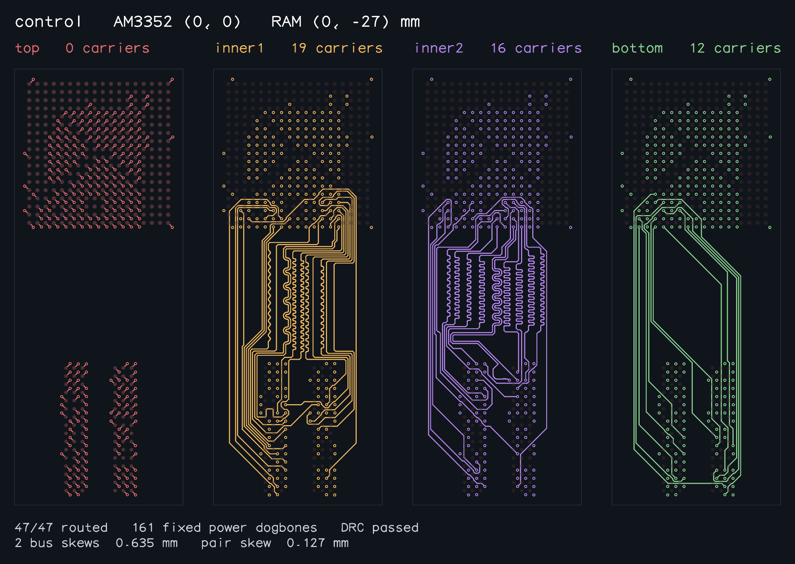

### control-inner1

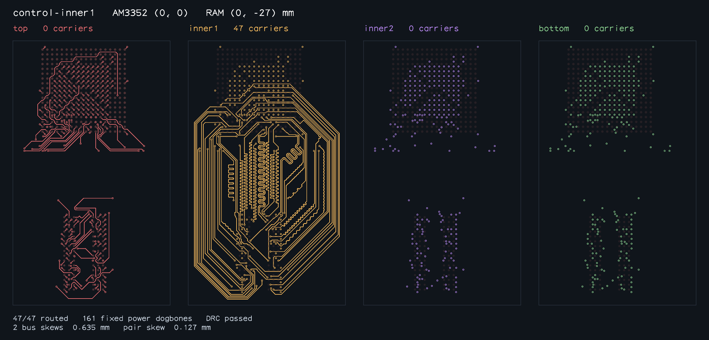

### right

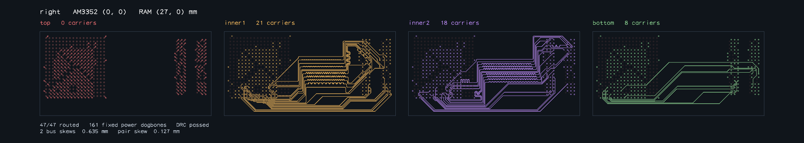

### left

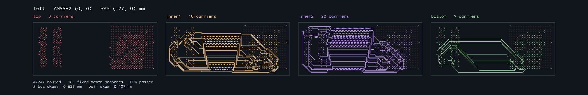

### above

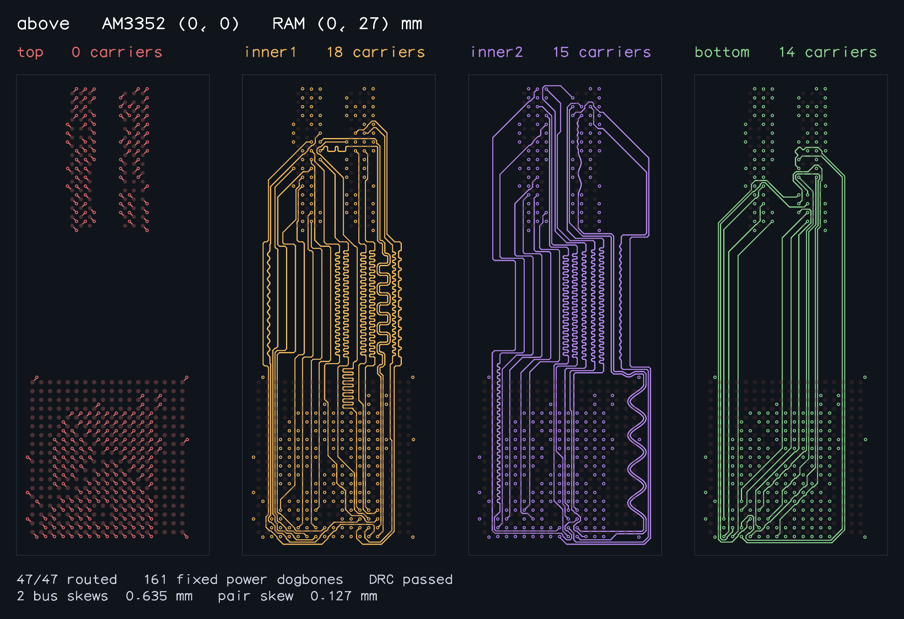

### inner-layers

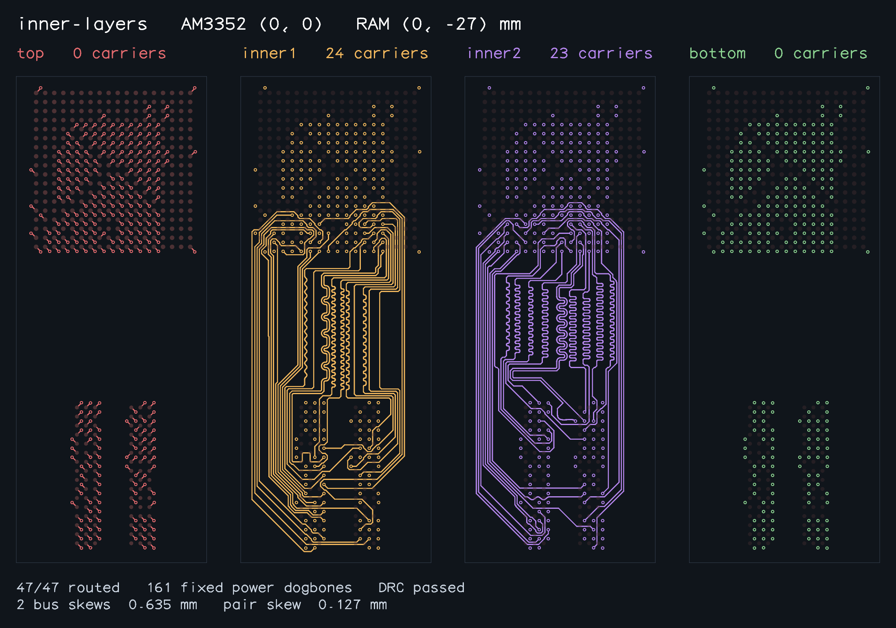

### inner-layers-right

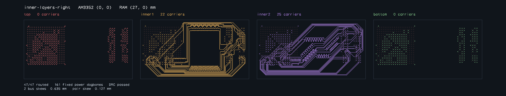

### inner-layers-left

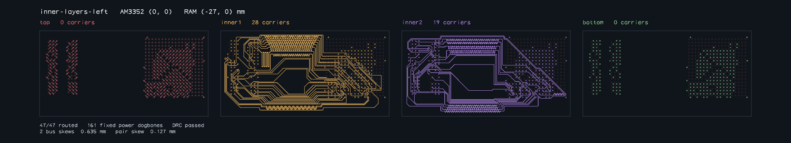

### inner-layers-above

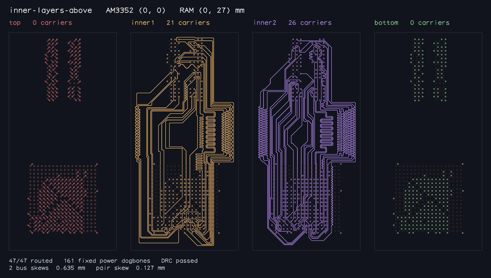

### inner-layers-complete-ca

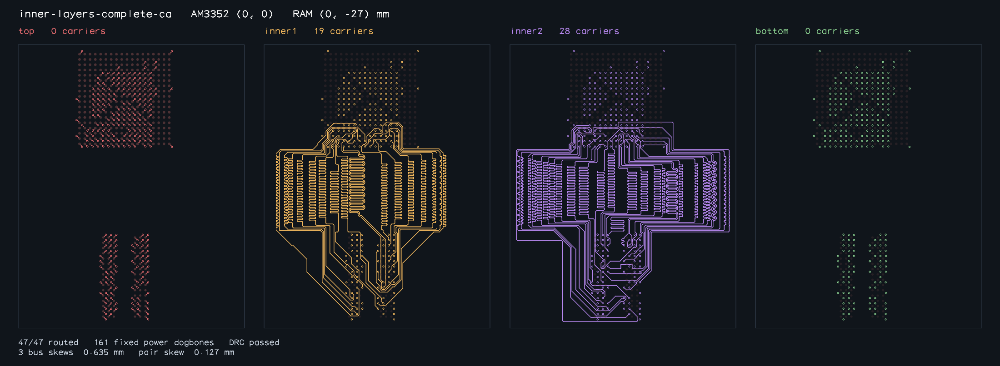

### outer-layers

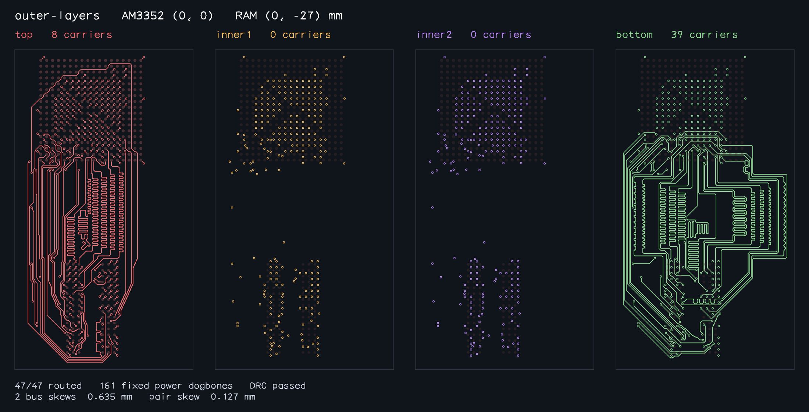
